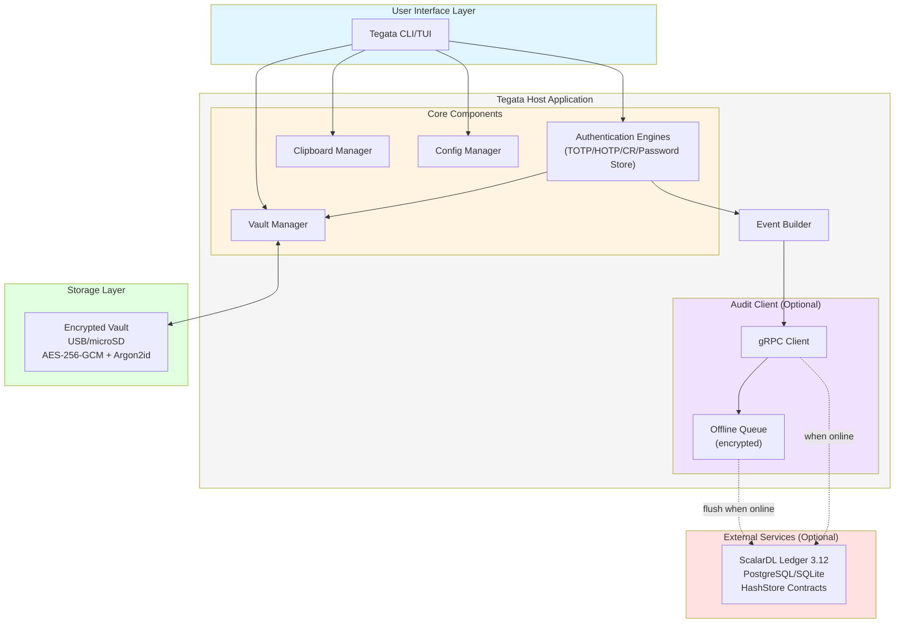

# Tegata: Portable authenticator with tamper-evident audit logging

> *"Your authentication history. Integrity checked."*

Tegata (手形) is an open-source portable authenticator with optional tamper-evident audit logging. Store encrypted authentication keys on standard USB drives or microSD cards, supporting TOTP, HOTP, challenge-response signing, and static password storage. The name references historical Japanese travel passes—handprint-stamped documents carried as portable proof of identity between checkpoint stations.

For project status, see [Projects](https://github.com/josh-wong/tegata/projects). For the development roadmap, see [Milestones](https://github.com/josh-wong/tegata/milestones).

## Key features

Tegata provides a **low-cost alternative to hardware security keys** like YubiKey, with optional [ScalarDL Ledger](https://scalardl.scalar-labs.com/) integration for immutable authentication event logging:

- **Encrypted vault storage:** AES-256-GCM encryption with Argon2id key derivation
- **Recovery key:** A separately stored 256-bit key allows vault recovery if the passphrase is lost
- **Multi-protocol support:** TOTP (RFC 6238), HOTP (RFC 4226), challenge-response signing (HMAC-SHA1/SHA256), static passwords
- **Portable:** Single static binary runs from USB drives/microSD cards with no external dependencies
- **Cross-platform:** Windows and macOS (v0.2+), Linux (v0.2+ if cross-compilation works without issues)
- **Tamper-evident audit logging:** Optional ScalarDL Ledger integration for immutable authentication history
- **Offline-first:** Queue events locally when audit ledger is unreachable
- **Open source:** Apache 2.0 license

## Architecture

Tegata follows a modular architecture with clear separation of concerns:



**Core components:**

1. **Vault storage layer:** Handles encryption/decryption of the vault file on USB/microSD by using AES-256-GCM and Argon2id
2. **Authentication engines:** TOTP (RFC 6238), HOTP (RFC 4226), challenge-response signing, password retrieval
3. **Audit layer:** Optional ScalarDL Ledger integration via gRPC for tamper-evident logging
4. **Offline queue:** Stores authentication events when ledger is unreachable (encrypted)
5. **CLI/TUI interface:** Command-line and terminal user interface for all operations
6. **Clipboard manager:** Secure temporary code storage with auto-clear

For detailed architecture documentation, see [section "2. Architecture overview" in the design document](docs/v1-design-doc.md#2-architecture-overview).

## Getting started

> [!WARNING]
>
> Tegata is not yet released. This section will be updated when v0.2 (MVP) is available.

### Installation

Installation instructions will be provided when the first release (v0.2 MVP) is ready. The application will be distributed as single static binaries for Windows and macOS, with Linux support if cross-compilation works without issues.

### Basic usage

Planned CLI commands (subject to change during development):

```bash
# Initialize a new vault on the current drive
tegata init

# Add a TOTP credential (secret prompted interactively)
tegata add --totp GitHub

# Generate a code
tegata code github

# List all entries
tegata list

# View authentication history (requires ScalarDL Ledger)
tegata history

# Verify audit chain integrity (requires ScalarDL Ledger)
tegata verify
```

For planned functionality details, see the [product requirements document](docs/v1-product-requirements-doc.md) and [design document](docs/v1-design-doc.md).

### Development environment

For development environment setup, including Docker Compose configurations for local ScalarDL Ledger testing, see [section "11. Development and deployment" in the design document](docs/v1-design-doc.md#11-development-and-deployment).

## Security model

> [!IMPORTANT]
>
> **Tegata is a software authenticator with portable key storage, NOT a hardware security key replacement.** Keys are decrypted in host memory when used, providing portability and auditability but **not** hardware-level key isolation.

### What Tegata provides

- **Portability:** Carry your authentication keys on any USB drive or microSD card
- **Encryption:** AES-256-GCM with Argon2id key derivation protects your vault
- **Auditability:** Optional tamper-evident logging of every authentication event
- **Transparency:** Open-source code under Apache 2.0, fully auditable
- **Cross-platform compatibility:** Single binary works across Windows, macOS, and Linux

### What Tegata does NOT provide

- **Hardware-level key isolation:** Unlike YubiKey or other hardware security keys, Tegata decrypts keys in host memory where they are vulnerable to memory dumps and malware
- **Protection against compromised hosts:** If your computer is compromised, Tegata cannot protect you
- **FIDO2/WebAuthn support:** Tegata does not implement FIDO2 (by design—FIDO2 requires hardware attestation)
- **Secure element protection:** No tamper-resistant hardware isolates cryptographic operations

### Recommendations

- **Appropriate use cases:** Personal authentication at low to medium security requirements, development environments, testing, educational purposes
- **NOT appropriate for:** High-security environments requiring hardware-level isolation, enterprise production systems with strict security mandates
- **Best practices:** Use full-disk encryption on host machines, maintain physical security of USB drives, use strong vault passphrases (20+ characters), consider hardware keys for high-value accounts

For a detailed discussion of security tradeoffs, see [section "2.2 What Tegata does NOT solve" in the product requirements document](docs/v1-product-requirements-doc.md#22-what-tegata-does-not-solve) and [section "8. Security model" in the design document](docs/v1-design-doc.md#8-security-model).

## Project documents

| Document                                                      | Description                                                                |
|---------------------------------------------------------------|----------------------------------------------------------------------------|
| [Product requirements document](docs/v1-product-requirements-doc.md) | Complete project requirements, use cases, target audience, and release plan |
| [Design document](docs/v1-design-doc.md)                        | Technical architecture, component specifications, and integration guides   |
| [CLI/TUI mockups](docs/v1-cli-tui-mockups.md)                   | Character-level visual spec for all CLI commands and TUI wireframes        |
| [Pull request template](.github/pull_request_template.md)    | PR checklist including security considerations and testing requirements    |

## Contributing

Contributions are welcome! Please review the [product requirements document](docs/v1-product-requirements-doc.md) and [design document](docs/v1-design-doc.md) to understand project architecture and goals before contributing.

Contribution guidelines will be published before v1.0. For now, feel free to:

- Open issues for bugs, feature requests, or architectural questions
- Discuss implementation approaches in GitHub Discussions (coming soon)
- Review and comment on open pull requests

## License

- **Tegata core:** Apache 2.0
- **ScalarDL Ledger integration:** Apache 2.0 (Community Edition only; ScalarDL Auditor requires an enterprise license and is explicitly out of scope)

See [LICENSE](LICENSE) for full license text.

## Acknowledgments

This project uses [ScalarDL Ledger](https://github.com/scalar-labs/scalardl) (Community Edition, Apache 2.0) for tamper-evident audit logging. For more information about the historical context of the Tegata name, see [section "1.2 Project name origin" in the product requirements document](docs/v1-product-requirements-doc.md#12-project-name-origin).

## References

- [ScalarDL documentation](https://scalardl.scalar-labs.com/docs/latest/)
- [TOTP RFC 6238](https://datatracker.ietf.org/doc/html/rfc6238)
- [HOTP RFC 4226](https://datatracker.ietf.org/doc/html/rfc4226)
- [HMAC RFC 2104](https://datatracker.ietf.org/doc/html/rfc2104)
