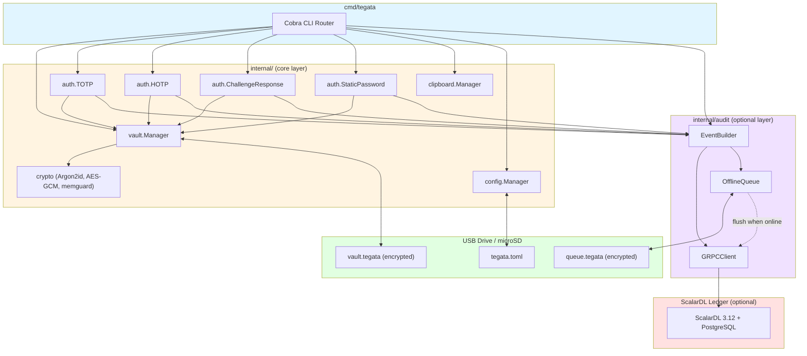

# Tegata – Design document

**Author:** [josh-wong](https://github.com/josh-wong)
**Date:** March 12, 2026
**Last revised:** March 12, 2026
**Status:** Draft
**Companion document:** [Product requirements document](./product-requirements-doc.md)

---

## 1. Introduction

This document describes the technical architecture, component design, and implementation strategy for Tegata, an open-source portable authenticator with optional tamper-evident audit logging. It serves as the companion to the [product requirements document](./product-requirements-doc.md) and provides the engineering detail needed to implement the system.

### 1.1 Purpose

The design document translates the PRD's functional and non-functional requirements into concrete technical decisions: which language, which libraries, how data is structured on disk, how components communicate, and how the system is built, tested, and deployed. Developers should read the PRD for *what* and *why*; this document covers *how*.

### 1.2 Terminology

The following terms are used throughout this document.

| Term              | Definition                                                                                           |
|-------------------|------------------------------------------------------------------------------------------------------|
| **Vault**         | The AES-256-GCM encrypted file on the USB drive that stores all credentials and metadata             |
| **Credential**    | A single authentication entry (TOTP secret, HOTP secret, challenge-response key, or static password) |
| **Label**         | A user-assigned name for a credential (for example, `GitHub` or `AWS-prod`)                          |
| **Passphrase**    | The user-provided secret used with Argon2id to derive the vault encryption key                       |
| **Recovery key**  | A randomly generated key stored offline that can decrypt the vault if the passphrase is lost          |
| **DEK**           | Data encryption key — the AES-256 key derived from the passphrase via Argon2id                       |
| **Event**         | A single authentication operation record submitted to ScalarDL Ledger                                |
| **HashStore**     | ScalarDL's built-in generic contract abstraction for storing and validating hash-chained records      |
| **Offline queue** | An encrypted local buffer that stores audit events when the ScalarDL Ledger instance is unreachable   |

### 1.3 Key decisions

The following table summarizes the major architectural decisions resolved during v0.1 planning.

| Decision           | Choice                     | Rationale                                                                                                                                                                                                                        |
|--------------------|----------------------------|----------------------------------------------------------------------------------------------------------------------------------------------------------------------------------------------------------------------------------|
| **Language**        | Go                         | Faster development velocity, simpler cross-compilation (`GOOS`/`GOARCH` flags), mature ecosystem for CLI tools and gRPC. Rust's stronger memory safety is valuable but adds development time that delays the MVP.                |
| **Vault format**    | JSON (whole-blob AES-256-GCM) | Simpler than SQLite for the expected vault size (tens to low hundreds of credentials). The entire JSON blob is encrypted as a single unit, avoiding the complexity of per-field or per-row encryption. Atomic writes via temp-file rename. |
| **Vault encryption** | AES-256-GCM               | NIST-approved authenticated encryption. Provides both confidentiality and integrity in a single operation. Well-supported by Go's `crypto/aes` and `crypto/cipher` standard library.                                             |
| **Key derivation**  | Argon2id                   | Winner of the Password Hashing Competition. Resists both GPU and ASIC attacks via memory-hard computation. The `id` variant combines Argon2i (side-channel resistance) and Argon2d (GPU resistance).                             |
| **Memory safety**   | memguard                   | Go library that allocates sensitive data in guarded memory pages (mlock, mprotect, canary checks). Provides `Enclave` and `LockedBuffer` types for key material lifecycle management.                                            |
| **gRPC client**     | grpc-go                    | Official Go gRPC implementation. Tegata implements a lightweight client against ScalarDL's protobuf service definitions rather than wrapping the Java Client SDK.                                                                |

## 2. Architecture overview

Tegata follows a layered architecture that separates the core authenticator (offline-capable, standalone) from the optional audit layer (requires a ScalarDL Ledger server). This section maps the PRD's architectural vision (PRD section 5) to concrete Go packages and data flows.

### 2.1 Package layout

The codebase is organized by responsibility. Each top-level package corresponds to a distinct component in the architecture.

```
tegata/
├── cmd/
│   └── tegata/          # CLI entrypoint (cobra commands)
│       └── main.go
├── internal/
│   ├── vault/           # Vault Manager – encrypt, decrypt, read, write
│   ├── auth/            # Authentication engines – TOTP, HOTP, CR, static
│   ├── clipboard/       # Clipboard Manager – copy, auto-clear
│   ├── config/          # Config Manager – tegata.toml parsing, defaults
│   ├── audit/           # Event Builder + gRPC client + offline queue
│   └── crypto/          # Shared crypto primitives – Argon2id, AES-GCM, memguard wrappers
│       └── guard/       # memguard wrapper – SecretBuffer, KeyEnclave
├── pkg/
│   └── model/           # Shared types – Credential, AuthEvent, VaultHeader
├── scripts/             # Build, release, and CI helper scripts
├── deployments/
│   └── docker-compose/  # ScalarDL Ledger + PostgreSQL local setup
├── docs/                # PRD, design doc, and other documentation
├── go.mod
└── go.sum
```

Packages under `internal/` are not importable by external code. The `pkg/model/` package contains shared data types used across internal packages.

### 2.2 Component diagram

The following diagram shows the runtime relationships between components.



### 2.3 Data flow: TOTP code generation

This sequence shows the complete flow when a user runs `tegata code GitHub`, including the optional audit path.

```
User                CLI               VaultManager    auth.TOTP     EventBuilder    GRPCClient
 │                   │                     │              │              │               │
 │─ tegata code GitHub ──>│                │              │              │               │
 │                   │── Unlock(pass) ────>│              │              │               │
 │                   │                     │── Argon2id ──┐              │               │
 │                   │                     │<── DEK ──────┘              │               │
 │                   │                     │── AES-GCM decrypt ──┐      │               │
 │                   │                     │<── JSON credentials ┘      │               │
 │                   │<── TOTP secret ─────│              │              │               │
 │                   │── Generate(secret) ─────────────>│              │               │
 │                   │<── code + TTL ───────────────────│              │               │
 │<── display code ──│                     │              │              │               │
 │                   │── LogEvent(TOTP, GitHub) ─────────────────────>│               │
 │                   │                     │              │              │── Put() ────>│
 │                   │                     │              │              │<── OK ───────│
 │                   │                     │── zero DEK ──┐              │               │
 │                   │                     │<─────────────┘              │               │
```

If the gRPC call fails, `EventBuilder` routes the event to `OfflineQueue` instead. The queue flushes automatically on the next successful connection.

### 2.4 Data flow: audit verification

When a user runs `tegata verify`, the following flow executes.

```
User                CLI             GRPCClient          ScalarDL Ledger
 │                   │                  │                      │
 │─ tegata verify ──>│                  │                      │
 │                   │── Validate() ──>│                      │
 │                   │                  │── ExecuteContract(object.Validate) ──>│
 │                   │                  │<── chain status ──────────────────────│
 │                   │<── result ───────│                      │
 │<── "N events verified" ─│            │                      │
```

### 2.5 Dependency list

The following Go modules are expected dependencies for the initial implementation.

| Module                                    | Purpose                                      | License    |
|-------------------------------------------|----------------------------------------------|------------|
| `github.com/spf13/cobra`                  | CLI command routing and flag parsing         | Apache 2.0 |
| `github.com/awnumar/memguard`             | Guarded memory for sensitive data (accessed only via `internal/crypto/guard`) | Apache 2.0 |
| `golang.org/x/crypto/argon2`              | Argon2id key derivation                      | BSD-3      |
| `google.golang.org/grpc`                  | gRPC client for ScalarDL communication       | Apache 2.0 |
| `google.golang.org/protobuf`              | Protobuf serialization for gRPC messages     | BSD-3      |
| `github.com/BurntSushi/toml`             | TOML configuration file parsing              | MIT        |
| `github.com/atotto/clipboard`             | Cross-platform clipboard access              | BSD-3      |
| `crypto/aes`, `crypto/cipher` (stdlib)    | AES-256-GCM encryption/decryption           | Go license |
| `crypto/hmac`, `crypto/sha1/sha256/sha512` (stdlib) | HMAC and hash operations for TOTP/HOTP/CR | Go license |

## 3. Vault format and storage

The vault is the central data structure in Tegata. It stores all credentials encrypted on the USB drive or microSD card. This section covers the on-disk format, the inner JSON schema, encryption parameters, and the write strategy.

### 3.1 File structure

The vault file (`vault.tegata`) consists of a plaintext header followed by an encrypted blob.

```
┌─────────────────────────────────────────┐
│  Plaintext header (fixed-size, 128 B)   │
│  ┌─────────────────────────────────────┐│
│  │ Magic bytes: "TEGATA\x00\x01"  (8B)││
│  │ Version: uint16              (2B)   ││
│  │ Argon2id time cost: uint32   (4B)   ││
│  │ Argon2id memory cost: uint32 (4B)   ││
│  │ Argon2id parallelism: uint8  (1B)   ││
│  │ Salt: [32]byte               (32B)  ││
│  │ Recovery key salt: [32]byte  (32B)  ││
│  │ Write counter: uint64        (8B)   ││
│  │ Nonce: [12]byte              (12B)  ││
│  │ Reserved: [13]byte           (13B)  ││
│  └─────────────────────────────────────┘│
├─────────────────────────────────────────┤
│  Encrypted blob (variable size)         │
│  AES-256-GCM(DEK, nonce, JSON payload) │
│  Includes 16-byte GCM auth tag         │
└─────────────────────────────────────────┘
```

The plaintext header stores only the parameters needed to derive the decryption key. It reveals no information about the vault contents (number of credentials, labels, or types). The write counter is a monotonic uint64 incremented on each vault write; the 12-byte nonce is derived deterministically from it as `counter_be8 || zeros4`. Storing both the counter and derived nonce in the header allows direct nonce validation during decryption without recomputation. The reserved bytes allow future header extensions without breaking compatibility.

### 3.2 Inner JSON schema

After decryption, the blob contains a JSON document with the following structure.

```json
{
  "version": 1,
  "created_at": "2026-03-12T10:00:00Z",
  "modified_at": "2026-03-12T14:30:00Z",
  "credentials": [
    {
      "id": "a1b2c3d4-e5f6-7890-abcd-ef1234567890",
      "label": "GitHub",
      "issuer": "GitHub",
      "type": "totp",
      "algorithm": "SHA1",
      "digits": 6,
      "period": 30,
      "secret": "base32-encoded-secret",
      "tags": ["dev", "work"],
      "created_at": "2026-03-12T10:05:00Z",
      "modified_at": "2026-03-12T10:05:00Z"
    },
    {
      "id": "b2c3d4e5-f6a7-8901-bcde-f12345678901",
      "label": "AWS-prod",
      "issuer": "Amazon",
      "type": "hotp",
      "algorithm": "SHA1",
      "digits": 6,
      "counter": 42,
      "secret": "base32-encoded-secret",
      "tags": ["cloud"],
      "created_at": "2026-03-12T10:10:00Z",
      "modified_at": "2026-03-12T11:00:00Z"
    },
    {
      "id": "c3d4e5f6-a7b8-9012-cdef-123456789012",
      "label": "SSH-signing",
      "type": "challenge-response",
      "algorithm": "SHA256",
      "secret": "hex-encoded-key",
      "tags": [],
      "created_at": "2026-03-12T10:15:00Z",
      "modified_at": "2026-03-12T10:15:00Z"
    },
    {
      "id": "d4e5f6a7-b8c9-0123-defa-234567890123",
      "label": "WiFi-office",
      "type": "static",
      "secret": "plaintext-password-value",
      "tags": ["network"],
      "created_at": "2026-03-12T10:20:00Z",
      "modified_at": "2026-03-12T10:20:00Z"
    }
  ],
  "recovery_key_hash": "hex-encoded-sha256-of-recovery-key"
}
```

Fields vary by credential type. TOTP credentials include `algorithm`, `digits`, and `period`. HOTP credentials include `algorithm`, `digits`, and `counter`. Challenge-response credentials include `algorithm`. Static passwords have only `secret`. All types share `id`, `label`, `type`, `secret`, `tags`, `created_at`, and `modified_at`.

### 3.3 Argon2id parameters

The following parameters are used for key derivation from the user's passphrase.

| Parameter         | Default  | OWASP minimum | Rationale                                                                                                             |
|-------------------|----------|---------------|-----------------------------------------------------------------------------------------------------------------------|
| Time cost         | 3        | 2             | Three iterations balance security and NFR-9 (<3s) on commodity hardware                                              |
| Memory cost       | 64 MiB   | 19 MiB        | Well above minimum; 64 MiB feasible on all target platforms                                                          |
| Parallelism       | 4        | 1             | Matches common core counts; lower values appropriate for single-core hosts                                            |
| Salt length       | 32 bytes | —             | Exceeds recommended 16-byte minimum                                                                                   |
| Output key length | 32 bytes | —             | Produces 256-bit key for AES-256                                                                                      |

These parameters are stored in the vault header so that future versions can adjust them without breaking existing vaults. The `tegata bench` command benchmarks Argon2id on the current machine and recommends parameter adjustments if derivation exceeds 3 seconds. When reducing parameters, lower memory cost first (since memory cost is more resistant to GPU attacks than time cost). Never allow time cost below 2 or memory cost below 19 MiB (OWASP minimum) without an explicit override flag.

### 3.4 Encrypt/decrypt flow

**Encryption (on vault write):**

1. Serialize credentials to JSON.
2. Read the salt from the vault header (or generate a new one for `init`).
3. Derive the DEK from the passphrase using Argon2id with the stored parameters and salt.
4. Increment the write counter in the header.
5. Derive the 12-byte nonce from the write counter: `nonce = counter_be8 || zeros4`.
6. Encrypt the JSON blob using AES-256-GCM with the DEK and derived nonce.
7. Write the header (with updated write counter and derived nonce) and encrypted blob to a temporary file.
8. Rename the temporary file over the vault file (atomic on all target file systems).
9. Zero the DEK and plaintext JSON from memory using memguard.

**Decryption (on vault unlock):**

1. Read the plaintext header to extract salt, Argon2id parameters, write counter, and nonce.
2. Verify the nonce matches `deriveNonce(write_counter)` — reject if mismatched (header corruption).
3. Derive the DEK from the passphrase using the extracted parameters.
4. Decrypt the blob using AES-256-GCM with the DEK and nonce.
5. If decryption fails (GCM tag mismatch), the passphrase is incorrect — return an error.
6. Deserialize the JSON into in-memory credential structs (within memguard `LockedBuffer`).
7. Zero the DEK. The plaintext credentials remain in guarded memory until the vault locks.

The nonce derivation function ensures the counter and nonce are always consistent.

```go
func deriveNonce(counter uint64) [12]byte {
    var nonce [12]byte
    binary.BigEndian.PutUint64(nonce[:8], counter)
    // nonce[8:12] are already zero
    return nonce
}
```

The write counter starts at 1 on `tegata init` (counter 0 is reserved as an invalid state). The counter is stored as both the uint64 value and the derived 12-byte nonce in the header. Storing both allows direct nonce validation during decryption without recomputing. If the counter reaches 2^63, the vault format mandates key rotation via `tegata init` with a new salt — this bound is astronomically unreachable in practice but specified for format completeness.

### 3.5 Write strategy: temp-file rename with backup

Vault writes follow this sequence to prevent data loss.

1. Write the new vault contents to `vault.tegata.tmp` in the same directory.
2. If `vault.tegata.bak` exists, delete it.
3. Rename `vault.tegata` to `vault.tegata.bak`.
4. Rename `vault.tegata.tmp` to `vault.tegata`.

If the process crashes between steps 3 and 4, the backup file preserves the previous state. On startup, `vault.Manager` checks for orphaned `.tmp` files and warns the user. FAT32 and exFAT support atomic rename within the same directory, making this strategy safe on USB drives.

### 3.6 Recovery key

During `tegata init`, Tegata generates a 256-bit random recovery key encoded as a base32 string (52 characters, grouped for readability). The recovery key is a secondary DEK — the vault can be decrypted with either the passphrase-derived key or the recovery key. A SHA-256 hash of the recovery key is stored inside the encrypted vault to validate it without storing the key itself on disk.

Users must store the recovery key offline (printed, in a password manager, etc.). Tegata displays it once during init and never again.

## 4. Authentication engines

Each authentication protocol is implemented as a separate engine in the `internal/auth/` package. All engines share a common interface for credential access via `vault.Manager` and event emission via `audit.EventBuilder`.

### 4.1 TOTP (RFC 6238)

The TOTP engine generates time-based one-time passwords as specified in RFC 6238.

**Implementation details:**

- Compute `T = floor((current_unix_time - T0) / period)` where `T0 = 0` and `period` defaults to 30 seconds.
- Compute `HMAC(algorithm, secret, T)` where `algorithm` is SHA-1, SHA-256, or SHA-512.
- Apply dynamic truncation per RFC 4226 section 5.4 to produce a 6-digit or 8-digit code.
- Return the code and the number of seconds remaining in the current period.

**Supported parameters:**

| Parameter   | Values              | Default |
|-------------|---------------------|---------|
| Algorithm   | SHA-1, SHA-256, SHA-512 | SHA-1   |
| Digits      | 6, 8                | 6       |
| Period      | 15–120 seconds      | 30      |

**Validation:** Unit tests use the test vectors from RFC 6238 appendix B to verify correctness across all three hash algorithms.

### 4.2 HOTP (RFC 4226)

The HOTP engine generates counter-based one-time passwords as specified in RFC 4226.

**Implementation details:**

- Compute `HMAC-SHA1(secret, counter)` where `counter` is an 8-byte big-endian integer.
- Apply dynamic truncation to produce a 6-digit or 8-digit code.
- Increment the counter in the vault after each successful generation.
- Write the updated counter to disk immediately (vault re-encrypt and save) to prevent counter reuse on crash.

**Counter persistence:** The counter is stored in the credential's `counter` field inside the encrypted vault. Because the entire vault is re-encrypted on every counter update, the write-temp-rename strategy (section 3.5) ensures atomicity.

**Resynchronization:** If a user's counter drifts from the server, `tegata resync <label>` generates codes for a configurable look-ahead window (default 10) and prompts the user to confirm which code the server accepted, then updates the counter accordingly.

### 4.3 Challenge-response (HMAC)

The challenge-response engine signs arbitrary challenges using HMAC.

**Implementation details:**

- Accept a challenge via CLI argument (`tegata sign <label> <challenge>`) or stdin.
- Compute `HMAC(algorithm, secret, challenge)` where `algorithm` is SHA-1 or SHA-256.
- Output the hex-encoded signature to stdout.

**Use cases:** SSH authentication helpers, custom protocol integrations, and any system that accepts HMAC-based challenge-response authentication.

### 4.4 Static passwords and clipboard

The static password engine retrieves stored passwords and manages clipboard interaction.

**Retrieval flow:**

1. User runs `tegata get <label>`.
2. The password is copied to the system clipboard.
3. A background goroutine clears the clipboard after the configured timeout (default 45 seconds).
4. The password is never printed to stdout unless the user passes the `--show` flag.

**Clipboard manager:** The `internal/clipboard/` package wraps `github.com/atotto/clipboard` and adds auto-clear functionality. It spawns a goroutine that sleeps for the timeout duration, then overwrites the clipboard with an empty string. If the user copies something else before the timeout expires, the auto-clear cancels (to avoid erasing unrelated content).

## 5. CLI design

The CLI is built with Cobra and follows conventional Unix command-line patterns. All commands support `--help` with usage examples.

### 5.1 Command tree

```
tegata
├── init                    # Create a new vault
├── add [--totp|--hotp|--cr|--static] <label> [secret]
│                           # Add a credential
├── list                    # List all credentials
├── code <label>            # Generate TOTP/HOTP code
├── sign <label> [challenge]
│                           # Challenge-response signing
├── get <label>             # Retrieve static password (clipboard)
├── remove <label>          # Remove a credential
├── export <file>           # Export vault backup
├── import <file>           # Import vault backup
├── resync <label>          # Resynchronize HOTP counter
├── history                 # View audit event history
├── verify                  # Verify audit chain integrity
├── ledger
│   └── setup               # Configure and validate ScalarDL connection
├── config
│   └── show                # Display current configuration
└── version                 # Print version and build info
```

### 5.2 Global flags

| Flag                 | Short | Description                                   | Default        |
|----------------------|-------|-----------------------------------------------|----------------|
| `--vault <path>`     | `-v`  | Path to the vault file                        | Auto-detect    |
| `--config <path>`    | `-c`  | Path to the config file                       | Auto-detect    |
| `--no-audit`         |       | Suppress audit logging for this command       | `false`        |
| `--json`             |       | Output in JSON format (for scripting)         | `false`        |
| `--quiet`            | `-q`  | Suppress non-essential output                 | `false`        |

### 5.3 Vault auto-detection

When `--vault` is not specified, Tegata searches for a vault file in the following order:

1. The current working directory (`./vault.tegata`).
2. The directory containing the `tegata` binary (supports running directly from USB).
3. The path specified in `tegata.toml` (if a config file is found).

If no vault is found, Tegata prints a message suggesting `tegata init`.

### 5.4 Output conventions

**Human-readable output (default):** Designed for terminal use with color support (respects `NO_COLOR` environment variable). TOTP codes include a countdown indicator. Lists use aligned columns.

**JSON output (`--json` flag):** Machine-parseable output for scripting and integration. Every command produces a JSON object with at minimum `{ "status": "ok"|"error" }`.

### 5.5 Exit codes

| Code | Meaning                                    |
|------|--------------------------------------------|
| 0    | Success                                    |
| 1    | General error (invalid input, missing file)|
| 2    | Authentication error (wrong passphrase)    |
| 3    | Vault error (corrupted, missing, locked)   |
| 4    | Network error (ScalarDL unreachable)       |
| 5    | Integrity error (audit chain broken)       |

### 5.6 Usability targets

The CLI workflow is designed to meet two usability benchmarks from the PRD.

- **First-time setup under 5 minutes (NFR-15):** The `tegata init` command handles vault creation in a single interactive flow (passphrase entry, recovery key display). Adding a first credential via `tegata add --scan` with an `otpauth://` URI is a single command. The entire init-add-verify cycle requires three commands.
- **Daily use under 10 seconds (NFR-16):** The daily flow is `tegata code <label>`, passphrase entry, and code display. Vault auto-detection (section 5.3) eliminates the need to specify paths. Argon2id derivation targets under 3 seconds (section 3.3), and TOTP generation completes in under 100 ms after unlock.

## 6. Configuration

Tegata uses a TOML configuration file (`tegata.toml`) stored on the USB drive alongside the vault.

### 6.1 Configuration file

```toml
# tegata.toml — Tegata configuration

[vault]
# Idle timeout before auto-lock (seconds)
idle_timeout = 300

# Clipboard auto-clear timeout (seconds)
clipboard_timeout = 45

[audit]
# Enable ScalarDL audit logging
enabled = false

# ScalarDL Ledger server address
server = "localhost:50051"

# TLS certificate paths (relative to config file directory)
cert = "certs/client.pem"
key = "certs/client-key.pem"
ca = "certs/ca.pem"

# Offline queue settings
queue_max_events = 10000
queue_flush_interval = 60
```

### 6.2 Precedence rules

Configuration values are resolved in the following order (highest priority first):

1. **CLI flags** — override everything for the current command.
2. **Environment variables** — prefixed with `TEGATA_` (for example, `TEGATA_VAULT_IDLE_TIMEOUT=600`).
3. **Config file** — `tegata.toml` located via auto-detection (same search order as vault).
4. **Built-in defaults** — the values shown in the example above.

### 6.3 ScalarDL connection settings

The `[audit]` section configures the optional ScalarDL Ledger connection. When `enabled = false` (the default), Tegata operates as a standalone authenticator with no network activity.

When enabled, the gRPC client requires:

- A reachable server address (`server`).
- Valid TLS certificates (`cert`, `key`, `ca`).
- The `tegata ledger setup` command validates connectivity, negotiates TLS, and confirms that the required HashStore contracts are available on the Ledger instance.

## 7. ScalarDL integration

This section details how Tegata communicates with ScalarDL Ledger for tamper-evident audit logging. All functionality in this section is optional — Tegata operates as a fully functional authenticator without it.

### 7.1 gRPC client

Tegata implements a lightweight gRPC client using `grpc-go` against ScalarDL's protobuf service definitions. The client communicates with the `Ledger` gRPC service using a single RPC method — `ExecuteContract` — and varies behavior by passing different contract identifiers.

| Operation  | Contract identifier | Purpose                                       |
|------------|---------------------|-----------------------------------------------|
| Put        | `object.Put`        | Store an authentication event record          |
| Get        | `object.Get`        | Retrieve event records for history display    |
| Validate   | `object.Validate`   | Verify hash-chain integrity across all events |

All three operations are invoked via the `ExecuteContract` RPC method on ScalarDL's `Ledger` gRPC service. The contract identifier is passed as the `ContractId` field in `ContractExecutionRequest`, along with a JSON-formatted `ContractArgument` and certificate credentials. The ScalarDL proto file defines the `Ledger` service with `ExecuteContract(ContractExecutionRequest) returns (ContractExecutionResponse)` as the primary entry point.

The client handles TLS negotiation, certificate-based authentication, and automatic retry with exponential backoff for transient failures.

#### gRPC stub generation

Generated stubs are committed to the repository so that `go build` succeeds without requiring protoc. Stubs are regenerated only when the ScalarDL proto version changes.

```bash
# Install protoc plugins
go install google.golang.org/protobuf/cmd/protoc-gen-go@latest
go install google.golang.org/grpc/cmd/protoc-gen-go-grpc@latest

# Download ScalarDL proto file
curl -O https://raw.githubusercontent.com/scalar-labs/scalardl/master/rpc/src/main/proto/scalar.proto

# Generate Go stubs into internal/audit/rpc/
protoc --go_out=internal/audit/rpc --go-grpc_out=internal/audit/rpc scalar.proto
```

The first client call pattern follows this structure:

```go
conn, err := grpc.NewClient(
    serverAddr,
    grpc.WithTransportCredentials(credentials.NewTLS(tlsConfig)),
)
client := rpc.NewLedgerClient(conn)

req := &rpc.ContractExecutionRequest{
    ContractId:       "object.Put",
    ContractArgument: `{"object_id": "event-001", "hash_value": "abc123..."}`,
    CertHolderId:     certHolderID,
    CertVersion:      1,
}
resp, err := client.ExecuteContract(ctx, req)
```

Note that `grpc.NewClient` is used instead of the deprecated `grpc.Dial`.

### 7.2 AuthEvent struct

Each authentication operation produces an `AuthEvent` that is serialized and submitted to ScalarDL.

```go
type AuthEvent struct {
    EventID       string    // UUID v4
    Timestamp     time.Time // UTC
    OperationType string    // "totp", "hotp", "challenge-response", "static"
    LabelHash     string    // SHA-256(credential_label)
    ServiceHash   string    // SHA-256(issuer or service name)
    HostHash      string    // SHA-256(machine fingerprint)
    Success       bool      // Whether the operation succeeded
}
```

Labels, service names, and host identifiers are always hashed before transmission. This protects privacy even if the audit log is compromised — an attacker cannot determine which services the user authenticates with.

### 7.3 HashStore contract usage

Tegata uses ScalarDL's HashStore abstraction rather than custom Java contracts. This avoids requiring a JDK toolchain for contract compilation and deployment.

**Event storage flow:**

1. Serialize the `AuthEvent` to JSON.
2. Compute `SHA-256(serialized_event)`.
3. Call `ExecuteContract` with contract identifier `object.Put`, passing the event hash as the value and a sequential asset ID in the JSON argument.
4. ScalarDL appends the entry to the hash chain and returns confirmation.

**Verification flow:**

1. Call `ExecuteContract` with contract identifier `object.Validate` and the asset ID range to verify.
2. ScalarDL traverses the hash chain, recomputes hashes, and returns the validation result.
3. Tegata reports the result to the user.

### 7.4 Offline queue

When the ScalarDL Ledger instance is unreachable, events are stored in an encrypted local queue (`queue.tegata`) on the USB drive.

**Queue format:** The queue file uses AES-256-GCM encryption with random 96-bit nonces (not the vault's write-counter approach). Random nonces are safe for the queue because queue writes are bounded by authentication frequency — at a realistic rate of 100 operations per day, it would take over 100 years to approach the birthday-bound collision risk of approximately 2^32 encryptions. Using random nonces avoids the complexity of shared counter state between the vault and queue files. Each queue entry stores its own nonce alongside the ciphertext.

The queue uses a key derived from the same passphrase but with a distinct salt (stored in the queue file header), ensuring cryptographic separation from the vault. Events are stored as a JSON array of `AuthEvent` objects. A local hash chain (each event includes a hash of the previous event) protects integrity during the offline window.

**Flush behavior:**

- On every `tegata` command that produces an audit event, the client first attempts to flush any queued events before submitting the new event.
- If the flush succeeds, the queue file is cleared.
- If the flush fails, the new event is appended to the queue.
- A configurable maximum queue size (`queue_max_events`, default 10,000) prevents unbounded growth. When the limit is reached, the oldest events are dropped with a warning.

### 7.5 `tegata verify` and `tegata history`

**`tegata verify`:** Calls `ExecuteContract` with the `object.Validate` contract on the ScalarDL Ledger instance. Reports the total number of events verified and whether the hash chain is intact. If tampering is detected, reports the range of affected events.

**`tegata history`:** Calls `ExecuteContract` with the `object.Get` contract to retrieve event records. Supports filtering by date range (`--from`, `--to`), credential label (`--label`), and operation type (`--type`). Displays results in a human-readable table or JSON (`--json`).

**`tegata ledger setup`:** Performs `RegisterCertificate` to register the user's TLS certificate with the ScalarDL Ledger, followed by a test `ExecuteContract` call using `object.Put` with a sentinel value to confirm connectivity. The exact `RegisterCertificate` proto message fields (`CertHolderId`, `CertVersion`) require integration-test validation against ScalarDL 3.12 before implementation.

## 8. Security model

This section describes the threat model, cryptographic rationale, and operational security measures. Users should read this section to understand both what Tegata protects against and what it does not.

### 8.1 Threat model

Tegata is designed to protect against the following threats.

**In scope (Tegata provides meaningful protection):**

| Threat                               | Mitigation                                                                                            |
|--------------------------------------|-------------------------------------------------------------------------------------------------------|
| USB drive loss or theft              | Vault is AES-256-GCM encrypted with Argon2id. Without the passphrase, brute-force is computationally infeasible. |
| Passive filesystem snooping          | Vault contents are never written to disk in plaintext. Temp files are encrypted before write.         |
| Audit log tampering (casual)         | ScalarDL hash-chain integrity detects modifications, deletions, and insertions.                       |
| Credential eavesdropping in transit  | All ScalarDL communication uses TLS. Audit events contain only hashed identifiers.                    |
| Brute-force passphrase attacks       | Argon2id with 64 MiB memory cost and rate-limiting with exponential backoff.                          |

**Out of scope (Tegata does NOT protect against):**

| Threat                                     | Limitation                                                                                         |
|--------------------------------------------|----------------------------------------------------------------------------------------------------|
| Memory extraction on compromised host      | Keys are decrypted in host memory during use. Malware with memory access can extract them.         |
| Keylogger capturing passphrase             | The passphrase is entered via stdin on the host. Tegata cannot protect against keyloggers.          |
| Physical access to unlocked session        | An unlocked vault is accessible until idle timeout. Physical access to the terminal is a compromise.|
| Fully compromised ScalarDL Ledger server   | An attacker controlling both the database and the ScalarDL process could reconstruct a valid chain. |
| Cold boot attacks                          | memguard mitigates this with mlock but cannot guarantee protection on all hardware.                 |

### 8.2 Cryptographic rationale

**AES-256-GCM** was chosen over AES-256-CBC or XChaCha20-Poly1305 because GCM provides authenticated encryption (confidentiality + integrity) in a single operation, is NIST-approved, has hardware acceleration on modern CPUs (AES-NI), and is well-supported by Go's standard library with constant-time implementations.

**Argon2id** was chosen over bcrypt, scrypt, or PBKDF2 because it is the winner of the Password Hashing Competition (2015), the `id` variant combines side-channel resistance (Argon2i) with GPU resistance (Argon2d), it is memory-hard (configurable to 64 MiB), and it is recommended by OWASP for password hashing.

**HMAC-SHA1 for TOTP/HOTP** is specified by RFC 6238 and RFC 4226. While SHA-1 is deprecated for collision resistance, it remains secure for HMAC construction (HMAC-SHA1 security depends on PRF properties, not collision resistance). SHA-256 and SHA-512 are also supported for TOTP.

### 8.3 Cryptographic pitfall mitigations

The following table documents the five most critical cryptographic pitfalls identified during research and the specific mitigations that Tegata's design enforces. Each pitfall has caused real-world vulnerabilities in similar software.

| Pitfall                              | Risk                                                                                                                                                                              | Mitigation                                                                                                                                                                                                                                                          |
|--------------------------------------|-----------------------------------------------------------------------------------------------------------------------------------------------------------------------------------|---------------------------------------------------------------------------------------------------------------------------------------------------------------------------------------------------------------------------------------------------------------------|
| Nonce reuse in AES-256-GCM           | Two encryptions with the same key and nonce break GCM security — the authentication key can be recovered and all prior messages can be forged                                     | Write-counter nonce: monotonic uint64 counter in vault header, incremented before each write, nonce derived deterministically as `counter_be8 \|\| zeros4`. Counter starts at 1; reads never increment; a crashed write leaves an incremented counter on the next successful write. See section 3.4. |
| Key material copies escaping guarded memory | Go's garbage collector does not zero freed memory. Key bytes copied into plain `[]byte` slices survive in memory after vault locks.                                        | All key material access goes through `internal/crypto/guard`. `KeyEnclave.Open(fn func([]byte) error)` ensures key bytes exist only inside the callback; the buffer is destroyed on return. No function should accept `key []byte` parameters — use `*guard.KeyEnclave` instead.               |
| Weak Argon2id parameters             | Using insufficient memory cost (e.g., t=1, m=4MiB, p=1) defeats GPU-resistance. Copy-pasted defaults from documentation examples are often dangerously low.                      | Defaults locked in vault header at creation: t=3, m=64MiB, p=4 (above OWASP minimums). `tegata bench` warns if derivation exceeds 3 seconds. Never allow t < 2 or m < 19 MiB without explicit override. See section 3.3.                                                                       |
| HOTP counter race condition          | If the counter is incremented in memory but the vault write fails, the in-memory and on-disk counters diverge, causing authentication failures.                                    | Correct order: (1) increment counter in-memory, (2) write vault with new counter to temp file, (3) atomic rename over vault, (4) generate and return code. If step 2 or 3 fails, the code is never displayed — user retries with same counter. See section 3.5 for atomic write strategy.        |
| memguard pre-v1 API instability      | memguard explicitly warns its API may change. Direct usage throughout the codebase means a breaking change requires updates across all packages.                                   | All memguard usage MUST go through `internal/crypto/guard`. This is an architectural rule, not a recommendation. Only `internal/crypto/guard` may import `github.com/awnumar/memguard`.                                                                                                          |

### 8.4 memguard key lifecycle

All memguard operations are accessed through the `internal/crypto/guard` wrapper package, which provides `SecretBuffer` (for sensitive byte slices like passphrases) and `KeyEnclave` (for the DEK, encrypted in RAM). This wrapper isolates memguard's pre-v1 API behind stable Tegata-specific types. See the pitfall table in section 8.3 for the architectural rationale.

The following lifecycle applies to all key material in Tegata.

```
Passphrase entry (stdin)
        │
        ▼
┌─────────────────────────┐
│  guard.NewSecretBuffer   │  Passphrase stored in mlock'd, guard-paged memory
└────────┬────────────────┘
         │
         ▼
┌─────────────────────────┐
│  Argon2id derivation     │  DEK derived, passphrase buffer destroyed
└────────┬────────────────┘
         │
         ▼
┌─────────────────────────┐
│  guard.NewKeyEnclave     │  DEK sealed in encrypted enclave (encrypted in RAM)
└────────┬────────────────┘
         │
         ▼  (on vault access)
┌─────────────────────────┐
│  KeyEnclave.Open(fn)     │  DEK temporarily unsealed inside callback, re-sealed on return
└────────┬────────────────┘
         │
         ▼
┌─────────────────────────┐
│  KeyEnclave.Destroy()    │  DEK memory zeroed and deallocated on vault lock
└─────────────────────────┘
```

**Rules:**

- Plaintext passphrases never exist outside of a `guard.SecretBuffer`.
- The DEK is stored in a `guard.KeyEnclave` (encrypted in RAM) between operations.
- After each vault operation, the unsealed DEK buffer is re-sealed immediately.
- On vault lock (idle timeout or explicit lock), the `KeyEnclave` is destroyed and all memory is zeroed.

### 8.5 Guard wrapper package

The `internal/crypto/guard` package provides stable Tegata-specific types over memguard's pre-v1 API. It is the only package in the codebase permitted to import `github.com/awnumar/memguard`.

```go
// internal/crypto/guard/guard.go

// SecretBuffer wraps memguard.LockedBuffer for sensitive byte slices
// (passphrases, plaintext credential bytes).
type SecretBuffer struct {
    lb *memguard.LockedBuffer
}

func NewSecretBuffer(data []byte) (*SecretBuffer, error)
func (s *SecretBuffer) Bytes() []byte   // read-only view; invalidated on Destroy
func (s *SecretBuffer) Destroy()

// KeyEnclave wraps memguard.Enclave for the DEK (encrypted in RAM).
type KeyEnclave struct {
    enc *memguard.Enclave
}

func NewKeyEnclave(key []byte) (*KeyEnclave, error)
func (e *KeyEnclave) Open(fn func([]byte) error) error  // unseals, calls fn, re-seals
func (e *KeyEnclave) Destroy()
```

The `Open(fn)` pattern is the only way to access DEK bytes. This ensures the key is never stored in a local variable — the callback receives a slice backed by the guarded buffer, and the buffer is destroyed when the callback returns.

### 8.6 Passphrase rate-limiting

Failed passphrase attempts trigger exponential backoff.

| Attempt | Delay     |
|---------|-----------|
| 1–3     | No delay  |
| 4       | 1 second  |
| 5       | 2 seconds |
| 6       | 4 seconds |
| 7       | 8 seconds |
| 8+      | 16 seconds (cap) |

The delay is enforced in-process (not stored on disk) to prevent bypass by restarting the binary. After 20 consecutive failures, Tegata prints a warning suggesting the user may be using the wrong vault or passphrase.

### 8.7 Software authenticator limitations

Tegata prominently documents that it is a software authenticator, not a hardware security key. The following limitations are displayed during `tegata init` and in `tegata --help`.

- Keys are decrypted in host memory and are vulnerable to memory extraction.
- Tegata does not implement FIDO2/WebAuthn (which requires hardware attestation).
- Tegata does not provide tamper-resistant hardware isolation.
- Users requiring hardware-level security should use a dedicated hardware security key.

## 9. Error handling

Tegata uses structured error categories and actionable messages to help users resolve problems.

### 9.1 Error categories

| Category       | Exit code | Description                                     | Example                                      |
|----------------|-----------|------------------------------------------------|----------------------------------------------|
| `input`        | 1         | Invalid user input or missing arguments        | `"Label 'GitHub' not found. Run 'tegata list' to see available credentials."` |
| `auth`         | 2         | Authentication failure                         | `"Incorrect passphrase. 2 attempts remaining before rate-limiting."` |
| `vault`        | 3         | Vault file issues                              | `"Vault file is corrupted. A backup exists at vault.tegata.bak — run 'tegata recover' to restore."` |
| `network`      | 4         | ScalarDL connectivity issues                   | `"Cannot reach ScalarDL Ledger at localhost:50051. Event queued locally (3 events pending)."` |
| `integrity`    | 5         | Audit chain integrity violation                | `"Hash chain broken at event #843. Run 'tegata history --around 843' for details."` |

### 9.2 Actionable message format

Every error message follows this structure:

1. **What happened** — a clear description of the problem.
2. **What to do** — a concrete next step the user can take.

Error messages never display raw stack traces, internal error codes, or technical jargon without explanation.

### 9.3 Graceful degradation

ScalarDL failures never block authentication operations. If the audit layer encounters an error, Tegata:

1. Completes the authentication operation normally.
2. Queues the audit event in the offline queue.
3. Prints a non-blocking warning: `"Warning: Audit event queued locally (ScalarDL unreachable)."`.

This ensures that the P0 requirement (functional authenticator) is never compromised by the P1 requirement (audit logging).

## 10. Testing strategy

Testing covers correctness, security, and cross-platform compatibility.

### 10.1 Unit tests

Unit tests verify the core logic of each component.

**Authentication engines:**

- TOTP tests use the RFC 6238 appendix B test vectors (SHA-1, SHA-256, SHA-512 at multiple time values).
- HOTP tests use the RFC 4226 appendix D test vectors (counter values 0–9).
- Challenge-response tests use known HMAC vectors from RFC 2104 and RFC 4231.

**Vault:**

- Round-trip tests: encrypt then decrypt, verify data integrity.
- Wrong-passphrase tests: confirm GCM tag verification fails.
- Corrupted-file tests: truncated files, modified headers, and modified ciphertext.

**Configuration:**

- Precedence tests: verify that CLI flags override env vars override config file override defaults.
- Malformed config tests: missing fields, invalid values, unknown keys.

### 10.2 Integration tests

**ScalarDL integration:**

- A Docker Compose environment (`deployments/docker-compose/`) provides a local ScalarDL Ledger instance with PostgreSQL for integration testing.
- Tests verify the full event lifecycle: Put, Get, Validate.
- Tests verify offline queue flush behavior: disconnect, queue events, reconnect, verify flush.
- Tests verify `tegata verify` detects tampered records.

**End-to-end CLI tests:**

- Script-driven tests exercise the full CLI workflow: `init` -> `add` -> `code` -> `verify`.
- Tests run against a real vault file on a temporary directory simulating a USB drive.

### 10.3 Platform testing

| Platform             | CI                 | Manual testing     |
|----------------------|--------------------|--------------------|
| Windows 10+ (amd64)  | GitHub Actions     | Developer machine  |
| macOS 12+ (arm64)    | GitHub Actions     | Developer machine  |
| macOS 12+ (amd64)    | GitHub Actions     | —                  |
| Linux (amd64)        | GitHub Actions     | Docker/WSL         |

Cross-compilation is verified in CI using `GOOS`/`GOARCH` flags with `CGO_ENABLED=0`.

### 10.4 Security and fuzz testing

- **Fuzz testing:** Go's built-in fuzzing (`go test -fuzz`) targets the vault decrypt path, TOTP generation, and otpauth:// URI parsing.
- **Static analysis:** `go vet`, `staticcheck`, and `gosec` run in CI on every pull request.
- **Dependency auditing:** `govulncheck` runs in CI to detect known vulnerabilities in dependencies.

## 11. Development and deployment

This section covers the developer setup, build process, cross-compilation strategy, and USB drive layout.

### 11.1 Development prerequisites

| Tool          | Version | Purpose                            |
|---------------|---------|------------------------------------|
| Go            | 1.23+   | Compiler and toolchain             |
| Docker        | 24+     | ScalarDL integration testing       |
| Docker Compose| 2.20+   | Local ScalarDL Ledger environment  |
| Git           | 2.40+   | Version control                    |
| golangci-lint | 1.60+   | Linting and static analysis        |

### 11.2 Build commands

```bash
# Development build (current platform)
go build -o tegata ./cmd/tegata

# Run tests
go test ./...

# Run tests with race detector
go test -race ./...

# Run fuzz tests (vault decrypt path, 30 seconds)
go test -fuzz=FuzzVaultDecrypt -fuzztime=30s ./internal/vault/

# Lint
golangci-lint run ./...

# Security scan
gosec ./...
govulncheck ./...
```

### 11.3 Cross-compilation

Tegata builds static binaries with no CGo dependencies (`CGO_ENABLED=0`). This is critical because the binary must run from a USB drive with no system library dependencies.

```bash
# Windows (amd64)
GOOS=windows GOARCH=amd64 CGO_ENABLED=0 go build -o tegata.exe ./cmd/tegata

# macOS (arm64 — Apple Silicon)
GOOS=darwin GOARCH=arm64 CGO_ENABLED=0 go build -o tegata-darwin-arm64 ./cmd/tegata

# macOS (amd64 — Intel)
GOOS=darwin GOARCH=amd64 CGO_ENABLED=0 go build -o tegata-darwin-amd64 ./cmd/tegata

# Linux (amd64)
GOOS=linux GOARCH=amd64 CGO_ENABLED=0 go build -o tegata-linux-amd64 ./cmd/tegata
```

**CGO_ENABLED=0 constraint:** All Go dependencies must be pure Go. This rules out libraries that require CGo bindings (such as `go-sqlite3`). The decision to use JSON rather than SQLite for the vault format eliminates the primary CGo dependency risk.

**No elevated permissions (NFR-13):** Static binaries with no CGo dependencies, no installation step, and no system library requirements mean Tegata runs entirely in user space. It reads and writes only to the USB drive (vault, config, queue files) and the system clipboard. No admin/root privileges are required on any supported platform.

### 11.4 USB drive layout

After setup, the USB drive or microSD card contains the following files.

```
USB_DRIVE/
├── tegata.exe              # Windows binary
├── tegata-darwin-arm64     # macOS (Apple Silicon) binary
├── tegata-darwin-amd64     # macOS (Intel) binary
├── tegata-linux-amd64      # Linux binary
├── vault.tegata            # Encrypted vault file
├── tegata.toml             # Configuration (optional)
├── queue.tegata            # Offline audit queue (created when needed)
├── certs/                  # TLS certificates for ScalarDL (optional)
│   ├── client.pem
│   ├── client-key.pem
│   └── ca.pem
└── README.txt              # Quick-start instructions
```

All binaries are included so users can plug the drive into any supported platform and run the appropriate binary.

### 11.5 ScalarDL Docker Compose (development)

A `deployments/docker-compose/docker-compose.yml` provides a local ScalarDL Ledger instance for development and testing.

```yaml
services:
  postgres:
    image: postgres:15
    environment:
      POSTGRES_DB: scalardl
      POSTGRES_USER: scalardl
      POSTGRES_PASSWORD: scalardl
    ports:
      - "5432:5432"
    volumes:
      - postgres-data:/var/lib/postgresql/data

  scalardl-ledger:
    image: ghcr.io/scalar-labs/scalardl-ledger:3.12
    depends_on:
      - postgres
    ports:
      - "50051:50051"
      - "50052:50052"
    environment:
      SCALAR_DL_LEDGER_DATABASE_TYPE: postgres
      SCALAR_DL_LEDGER_DATABASE_HOST: postgres
      SCALAR_DL_LEDGER_DATABASE_PORT: 5432
      SCALAR_DL_LEDGER_DATABASE_NAME: scalardl
      SCALAR_DL_LEDGER_DATABASE_USER: scalardl
      SCALAR_DL_LEDGER_DATABASE_PASSWORD: scalardl

volumes:
  postgres-data:
```

Run `docker compose up -d` from the `deployments/docker-compose/` directory to start the environment. Integration tests automatically detect this local instance.

### 11.6 CI/CD

GitHub Actions runs the following pipeline on every pull request.

| Step                  | Description                                             |
|-----------------------|---------------------------------------------------------|
| `go vet`              | Standard Go static analysis                             |
| `golangci-lint`       | Extended linting (unused code, error handling, style)   |
| `go test -race`       | Unit and integration tests with race detector           |
| `gosec`               | Security-focused static analysis                        |
| `govulncheck`         | Known vulnerability detection in dependencies           |
| Cross-compile (4 targets) | Verify all platform builds succeed                 |
| Binary size check     | Warn if any binary exceeds 20 MB (NFR-10)               |

Release builds use `goreleaser` to produce tagged, checksummed binaries for each platform. Releases are published as GitHub Releases with SHA-256 checksums.

## 12. Future considerations

The following features are explicitly deferred from v1.0 but may be considered in future versions.

**Terminal user interface (TUI):** A guided interactive interface using a library such as `bubbletea` for users who prefer visual navigation over CLI commands. Planned for v1.0 per the release plan.

**FIDO2/WebAuthn:** Implementing a software-based FIDO2 authenticator is technically possible but architecturally controversial. FIDO2 is designed around hardware attestation, and a software implementation would not provide the security guarantees that relying parties expect. This is explicitly deferred and would require significant security analysis before consideration.

**Standalone gRPC library:** The ScalarDL gRPC client implemented for Tegata could be extracted as a standalone open-source Go library, benefiting the broader ScalarDL ecosystem. This adds maintenance scope and is deferred until the client implementation stabilizes.

**Multi-user support:** The current design assumes a single user per vault. Supporting multiple users (for example, a shared team vault) would require access control, per-user encryption keys, and conflict resolution. This is a significant architectural change deferred to a future major version.

**GUI application:** Planned for v0.6. A Wails desktop application with full CLI feature parity, using CGO and the system WebView. The GUI binary is installed on the host machine (not on the USB drive). Architecture details are covered in the design document's GUI section (to be written in Phase 2).

## 13. References

Standards and specifications referenced in this document.

- [RFC 6238 – TOTP: Time-Based One-Time Password Algorithm](https://datatracker.ietf.org/doc/html/rfc6238)
- [RFC 4226 – HOTP: An HMAC-Based One-Time Password Algorithm](https://datatracker.ietf.org/doc/html/rfc4226)
- [RFC 2104 – HMAC: Keyed-Hashing for Message Authentication](https://datatracker.ietf.org/doc/html/rfc2104)
- [RFC 4231 – Identifiers and Test Vectors for HMAC-SHA-224, HMAC-SHA-256, HMAC-SHA-384, and HMAC-SHA-512](https://datatracker.ietf.org/doc/html/rfc4231)
- [NIST SP 800-38D – Recommendation for Block Cipher Modes of Operation: Galois/Counter Mode (GCM)](https://csrc.nist.gov/pubs/sp/800/38/d/final)
- [Argon2 Reference Implementation](https://github.com/P-H-C/phc-winner-argon2)
- [OWASP Password Storage Cheat Sheet](https://cheatsheetseries.owasp.org/cheatsheets/Password_Storage_Cheat_Sheet.html)

Go libraries referenced in this document.

- [spf13/cobra – CLI framework](https://github.com/spf13/cobra)
- [awnuber/memguard – Guarded memory for Go](https://github.com/awnuber/memguard)
- [grpc-go – gRPC for Go](https://github.com/grpc/grpc-go)
- [BurntSushi/toml – TOML parser for Go](https://github.com/BurntSushi/toml)
- [atotto/clipboard – Cross-platform clipboard for Go](https://github.com/atotto/clipboard)
- [golang.org/x/crypto – Extended Go crypto library (Argon2)](https://pkg.go.dev/golang.org/x/crypto)

ScalarDL documentation.

- [ScalarDL 3.12 Documentation](https://scalardl.scalar-labs.com/docs/3.12/)
- [Get Started with ScalarDL HashStore](https://scalardl.scalar-labs.com/docs/latest/getting-started-hashstore/)
- [Write a ScalarDL Application with the HashStore Abstraction](https://scalardl.scalar-labs.com/docs/latest/how-to-write-applications-with-hashstore/)
- [ScalarDL GitHub Repository](https://github.com/scalar-labs/scalardl)
