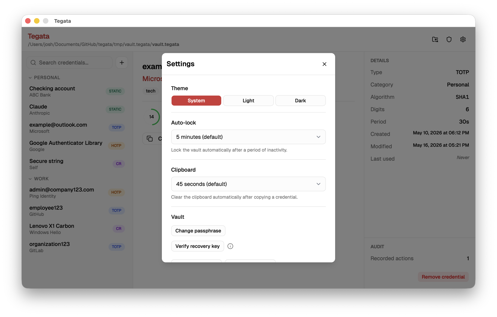

import Tabs from '@theme/Tabs';
import TabItem from '@theme/TabItem';

The Tegata desktop GUI provides the same vault management and credential operations as the CLI and TUI with a graphical interface. It includes a setup wizard, live TOTP countdown timers, a settings panel, and an audit panel.

:::note[The GUI stays on your host machine]

Unlike the CLI binary, which is designed to travel on the USB drive alongside your vault, the GUI is installed on your host machine. The vault file itself always lives on your USB drive or microSD card.

:::

## Install the GUI

<Tabs groupId="os">
  <TabItem value="windows" label="Windows">

Download `tegata-gui-windows-amd64-setup.exe` from the [GitHub Releases](https://github.com/josh-wong/tegata/releases) page. Run the installer and follow the prompts. The GUI is installed to `Program Files\Tegata\` and a Start Menu entry is created automatically.

  </TabItem>
  <TabItem value="macos" label="macOS">

Download `tegata-gui-darwin-universal.dmg` from the [GitHub Releases](https://github.com/josh-wong/tegata/releases) page. Open the disk image and drag **Tegata** to your **Applications** folder.

On first launch, macOS Gatekeeper may block the app. To clear the quarantine flag:

```bash
xattr -r -d com.apple.quarantine /Applications/Tegata.app
```

  </TabItem>
  <TabItem value="linux" label="Linux">

:::note[Linux support]

Linux has not been manually tested. These steps are expected to work, but if you run into issues, please [open an issue](https://github.com/josh-wong/tegata/issues).

:::

Download the package for your distribution from the [GitHub Releases](https://github.com/josh-wong/tegata/releases) page.

```bash
# Debian / Ubuntu
sudo dpkg -i tegata-gui-linux-amd64.deb

# Fedora / RHEL
sudo rpm -i tegata-gui-linux-amd64.rpm
```

The GUI requires WebKit2GTK. Install it if the package manager reports missing dependencies:

```bash
# Ubuntu 24.04+
sudo apt install libwebkit2gtk-4.1-dev

# Ubuntu 22.04 and earlier
sudo apt install libwebkit2gtk-4.0-dev
```

  </TabItem>
</Tabs>

## First launch and setup wizard

When you open Tegata for the first time, it prompts you to locate or create a vault. If your USB drive is already connected, select **Open existing vault** and navigate to the vault file. If you have not created a vault yet, select **Create new vault**.

The setup wizard guides you through:

1. **Choose vault location.** Select the USB drive or microSD card directory where the vault will be created.
2. **Create a passphrase.** Enter and confirm a passphrase. A strength indicator shows the estimated security level.
3. **Save your recovery key.** The recovery key is displayed once. Copy it and store it somewhere physically separate from the USB drive.
4. **Add your first credential.** Optionally add a credential immediately after setup, or skip this step.

:::danger[Save your recovery key before selecting Continue]

The recovery key screen will not appear again. If you lose your passphrase without this key, the vault cannot be recovered.

:::

## Main window

After unlocking, the main window shows your credential list with live TOTP countdowns.


The left sidebar lists all credentials. Each TOTP credential shows a circular countdown indicator that depletes as the current code window expires. The code refreshes automatically when the window rolls over—you do not need to select it.

### Generate a code

Select any credential in the list to select it. The code and countdown appear in the detail panel on the right. Select **Copy** to copy the code to your clipboard. The clipboard is cleared automatically after 45 seconds.

For static password credentials, selecting **Copy** retrieves the password without displaying it in the UI. To display the password, select the eye icon next to the field.


### Dark and light themes


The GUI respects your system appearance preference and switches between light and dark themes automatically. You can override this in the Settings panel.

## Adding a credential

Select the **+** button in the toolbar or the **Add credential** option in the File menu to open the add credential dialog.


The dialog has four tabs corresponding to the four credential types: **TOTP**, **HOTP**, **Challenge-response**, and **Static password**. Fill in the required fields and select **Add**.

You can also add a credential by pasting an `otpauth://` URI directly. Select **Scan URI** and paste the URI into the input field. The type, label, issuer, algorithm, digits, and period are populated automatically.

## Editing and removing credentials

Right-click a credential in the list to access options:

- **Edit tags.** Add or remove tags for organizing credentials
- **Copy code.** Same as single-clicking
- **Remove.** Shows a confirmation dialog before deleting

## Settings panel

Select the gear icon or open **Settings** from the application menu to access the settings panel.



Available settings:

| Setting | Description | Default |
|---------|-------------|---------|
| Clipboard clear delay | Seconds before the clipboard is cleared after copying | 45 |
| Idle timeout | Minutes before the vault auto-locks | 5 |
| Theme | Light, Dark, or System | System |
| Audit auto-start | Start Docker audit stack automatically on unlock | On (after `tegata ledger start`) |

## Audit panel

The audit panel is available after enabling audit logging with `tegata ledger start` (CLI) or through the Settings panel in the GUI.


The panel shows a table of recorded events with columns for operation type, credential label, timestamp (UTC), and event hash. Use the date filters to narrow the range. Select **Verify integrity** to run `tegata verify` and check the entire audit chain.

Events for removed credentials show as **(deleted)** in the label column. This is expected because the label hash is preserved in the ledger but the plaintext label is no longer in the vault.

## Vault management

Access vault management options from the **File** menu.

| Option | Description |
|--------|-------------|
| **Export backup** | Create an encrypted `.tegata-backup` file with an independent export passphrase |
| **Import backup** | Merge credentials from a `.tegata-backup` file into the current vault |
| **Change passphrase** | Rotate the vault passphrase |
| **Verify recovery key** | Confirm that your stored recovery key is still valid |
| **Lock vault** | Lock the vault immediately without quitting |

## Known limitations

- **Passphrase in WebView heap.** The passphrase is briefly held as a JavaScript string in the underlying WebView process. JavaScript strings are immutable and garbage-collected non-deterministically, so the passphrase may persist in the V8 heap for a short time after the Go side zeroes its copy. This is a known limitation of the WebView architecture. For guidance, see [security best practices](security-best-practices.mdx#key-material-handling).
- **No cross-compilation.** The GUI binary requires a native build for each platform because it depends on the system WebView (WebView2 on Windows, WKWebView on macOS, WebKit2GTK on Linux). Pre-built binaries for all platforms are available on the releases page.

For a keyboard-driven terminal experience without the overhead of a graphical application, see the [Using the TUI](tui-guide.mdx) guide.
