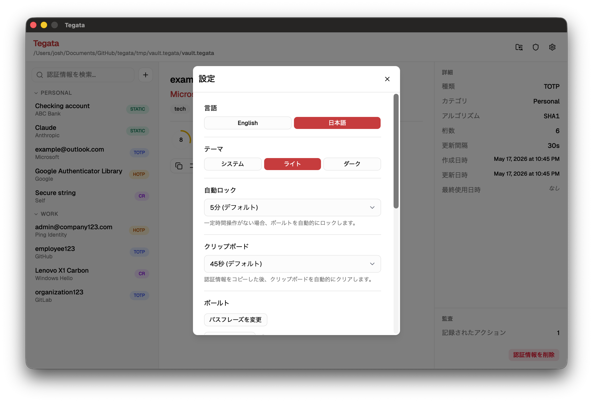
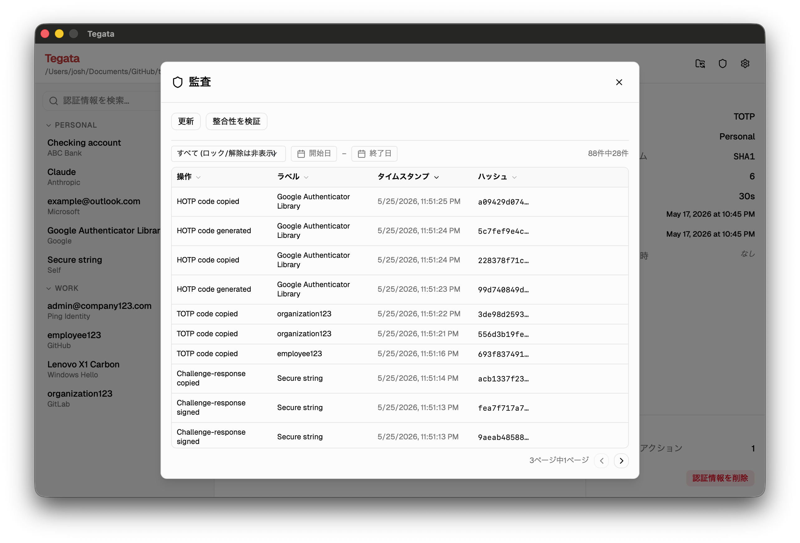

import Tabs from '@theme/Tabs';
import TabItem from '@theme/TabItem';

Tegata デスクトップ GUI は、グラフィカルインターフェースを使用して CLI および TUI と同じボールト管理とクレデンシャル操作を提供します。セットアップウィザード、タイプ固有のクレデンシャルアクション (例: TOTP カウントダウンタイマー)、設定パネル、および監査パネルが含まれています。

:::note[GUI はホストマシンに保存されます]

USB ドライブと一緒にボールトを持ち運ぶように設計された CLI バイナリとは異なり、GUI はホストマシンにインストールされます。ボールトファイル自体は常に USB ドライブまたは microSD カードに保存されます。

:::

## GUI のインストール

<Tabs groupId="os" queryString>
  <TabItem value="windows" label="Windows">

[GitHub リリース](https://github.com/josh-wong/tegata/releases)ページから `tegata-gui-windows-amd64-setup.exe` をダウンロードします。インストーラーを実行してプロンプトに従います。GUI は `Program Files\Tegata\` にインストールされ、スタートメニューのエントリが自動的に作成されます。

:::note

初回起動時に、Microsoft Defender SmartScreen が「このアプリを実行するにはご使用の PC は保護されています」と表示する場合があります。**詳細情報**を選択してから**実行**を選択してください。

:::
  </TabItem>
  <TabItem value="macos" label="macOS">

[GitHub リリース](https://github.com/josh-wong/tegata/releases)ページから `tegata-gui-darwin-universal.dmg` をダウンロードします。ディスクイメージを開き、**Tegata** を**アプリケーション**フォルダーにドラッグします。

:::note

初回起動時に、macOS Gatekeeper がアプリをブロックすることがあります。メッセージが表示された場合は、**システム設定 → プライバシーとセキュリティ**を開いて Tegata の**このまま開く**を選択します。Gatekeeper が引き続きブロックする場合は、検疫フラグをクリアします。

```bash
xattr -r -d com.apple.quarantine /Applications/Tegata.app
```

:::
  </TabItem>
  <TabItem value="linux" label="Linux">

:::note[Linux サポート]

Linux は手動でテストされていません。これらの手順は動作することが期待されますが、問題が発生した場合は [issue を作成](https://github.com/josh-wong/tegata/issues)してください。

:::

[GitHub リリース](https://github.com/josh-wong/tegata/releases)ページからディストリビューション用のパッケージをダウンロードします。

```bash
# Debian / Ubuntu
sudo dpkg -i tegata-gui-linux-amd64.deb

# Fedora / RHEL
sudo rpm -i tegata-gui-linux-amd64.rpm
```

GUI には WebKit2GTK が必要です。アプリが起動しない場合は、ディストリビューションのリリースに合ったランタイムパッケージをインストールして再試行します。

```bash
# Ubuntu / Debian (新しいリリース)
sudo apt install libwebkit2gtk-4.1-0

# Ubuntu / Debian (古いリリース)
sudo apt install libwebkit2gtk-4.0-37
```

それでもアプリが起動しない場合は、[トラブルシューティング](troubleshooting.mdx#gui-が起動しません)を参照してください。

  </TabItem>
</Tabs>

## セットアップウィザードを起動してボールトを作成する

Tegata を初めて開くと、ボールトの検索または作成を求めるメッセージが表示されます。USB ドライブがすでに接続されている場合は、**既存のボールトを開く**を選択してボールトファイルに移動します。まだボールトを作成していない場合は、**新しいボールトを作成**を選択します。

セットアップウィザードは以下の手順を案内します。

1. **ボールトの場所を選択します。** ボールトを作成する USB ドライブまたは microSD カードのディレクトリを選択します。
2. **パスフレーズを作成します。** パスフレーズを入力して確認します。強度インジケーターが推定セキュリティレベルを示します。
3. **リカバリーキーを保存します。** リカバリーキーは一度だけ表示されます。コピーして USB ドライブとは物理的に別の安全な場所に保管します。
4. **最初のクレデンシャルを追加します。** セットアップ直後にクレデンシャルを追加するか、この手順をスキップします。

:::danger[続行を選択する前にリカバリーキーを保存してください]

リカバリーキー画面は再度表示されません。このキーなしにパスフレーズを失った場合、ボールトを回復できません。

:::

## ボールトのアンロック

ボールトをアンロックすると、左サイドバーにクレデンシャルのリストが表示されます。


## クレデンシャルの追加

ツールバーの**+**ボタンまたはファイルメニューの**クレデンシャルを追加**オプションを選択して、クレデンシャル追加ダイアログを開きます。


ダイアログには4つのクレデンシャルタイプに対応する 4 つのタブがあります: **TOTP**、**HOTP**、**チャレンジ・レスポンス**、**スタティックパスワード**。必要なフィールドに入力して**追加**を選択します。

`otpauth://` URI を直接貼り付けてクレデンシャルを追加することもできます。**URI をスキャン**を選択して入力フィールドに URI を貼り付けます。タイプ、ラベル、発行者、アルゴリズム、桁数、および期間が自動的に入力されます。

## クレデンシャルの使用

リスト内の任意のクレデンシャルを選択します。右側の詳細パネルがクレデンシャルタイプに基づいて更新されます。

- **TOTP:** **コピー**を選択して現在の出力をクリップボードにコピーします。カウントダウンタイマーが次のコードまでの時間を示します。
- **HOTP:** **コードを生成**を選択して現在の出力をクリップボードにコピーします。クリップボードはデフォルトで45秒後に自動的にクリアされます (設定で変更可能)。
- **チャレンジ・レスポンス:** チャレンジ文字列を入力して**署名**を選択します。署名が生成されます。**コピー**を選択してクリップボードにコピーします。
- **スタティックパスワード:** **クリップボードにコピー**を選択してパスワードをコピーします。パスワードは UI に表示されません。これは、スタティックパスワードを使用する際のショルダーサーフィングや偶発的な露出を防ぐためのセキュリティ対策です。

:::note[クリップボードの自動クリア]

クリップボードはデフォルトで45秒後に自動的にクリアされます (設定で変更可能)。これは、手動でクリアするのを忘れた場合に機密データがクリップボードに残るリスクを最小化するためのセキュリティ対策です。

:::

## クレデンシャルの編集または削除

リスト内のクレデンシャルを右クリックしてオプションにアクセスします。

- **タグを編集する。** クレデンシャルを整理するためのタグを追加または削除します。
- **コードをコピーする。** OTP およびスタティックパスワードのクレデンシャルの場合、シングルクリックと同じです。
- **削除する。** 削除前に確認ダイアログが表示されます。

## アプリ設定の構成

設定パネルにアクセスするには、歯車アイコンを選択するか、アプリケーションメニューから**設定**を開きます。



利用可能な設定:

| 設定 | 説明 | デフォルト |
|---------|-------------|---------|
| クリップボードクリア遅延 | コピー後にクリップボードがクリアされるまでの秒数 | 45 |
| アイドルタイムアウト | ボールトが自動ロックされるまでの分数 | 5 |
| テーマ | ライト、ダーク、またはシステム | システム |
| 監査の自動起動 | アンロック時に Docker の監査スタックを自動的に起動する | オン (`tegata ledger start`の後) |

### ボールトの管理

設定パネルの**ボールト**セクションには、ボールトのクレデンシャルとパスフレーズを管理するためのオプションが含まれています。

| オプション | 説明 |
|--------|-------------|
| **パスフレーズを変更** | ボールトパスフレーズをローテーションする |
| **リカバリーキーを確認** | 保存されたリカバリーキーがまだ有効であることを確認する |
| **クレデンシャルをエクスポート** | 独立したエクスポートパスフレーズを使用して暗号化された `.tegata-backup` ファイルを作成する |
| **クレデンシャルをインポート** | `.tegata-backup` ファイルから現在のボールトにクレデンシャルをマージする |

別のボールトに切り替えるには、ヘッダーツールバーの**ボールトを切り替える**アイコンを選択します。既存のボールトを選択すると、現在のボールトがロックされてから新しいボールトが開きます。

### プロジェクトをサポート

**プロジェクトをサポート**セクションには、[GitHub Sponsors](https://github.com/sponsors/josh-wong)、[Ko-fi](https://ko-fi.com/josh_haha)、および [PayPal](https://www.paypal.me/joshww) へのリンクが含まれています。

:::note[サポートバナー]

同じリンクを含むバナーが、10回ボールトをアンロックするたびにメインウィンドウの下部に表示されます。**X** を選択して現在のセッションだけ非表示にするか、**今後表示しない**を選択して永続的に非表示にします。

:::

## 監査パネルでイベントを表示する

監査パネルは、`tegata ledger start` (CLI) または GUI の設定パネルを通じて監査ログを有効にした後に利用できます。



パネルには操作タイプ、クレデンシャルラベル、タイムスタンプ (UTC)、イベントハッシュの列を持つ記録済みイベントのテーブルが表示されます。日付フィルターを使用して範囲を絞り込みます。**整合性を確認**を選択して `tegata verify` を実行し、監査チェーン全体を確認します。

削除されたクレデンシャルのイベントは、ラベル列に **(deleted)** として表示されます。これは、ラベルハッシュがレジャーに保存されているが、平文のラベルがボールトにもう存在しないため、予想される動作です。

## 既知の制限事項

- **WebView ヒープ内のパスフレーズ。** パスフレーズは基盤となる WebView プロセスの JavaScript 文字列として一時的に保持されます。JavaScript 文字列はイミュータブルで非決定論的にガベージコレクションされるため、Go 側がコピーをゼロにした後も短時間パスフレーズが V8 ヒープに残る場合があります。これは WebView アーキテクチャの既知の制限です。詳細については、[セキュリティのベストプラクティス](security-best-practices.mdx#キーマテリアルの処理)を参照してください。
- **クロスコンパイルなし。** GUI バイナリは、システム WebView (Windows では WebView2、macOS では WKWebView、Linux では WebKit2GTK) に依存しているため、各プラットフォームのネイティブビルドが必要です。すべてのプラットフォーム向けのビルド済みバイナリはリリースページで入手できます。

グラフィカルアプリケーションのオーバーヘッドなしにキーボード駆動のターミナル操作を行う場合は、[TUI の使用](tui-guide.mdx)ガイドを参照してください。
