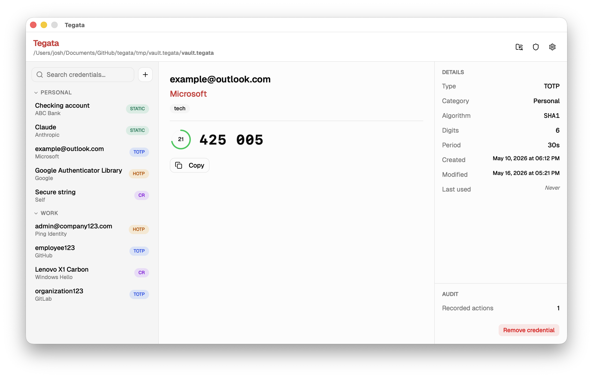
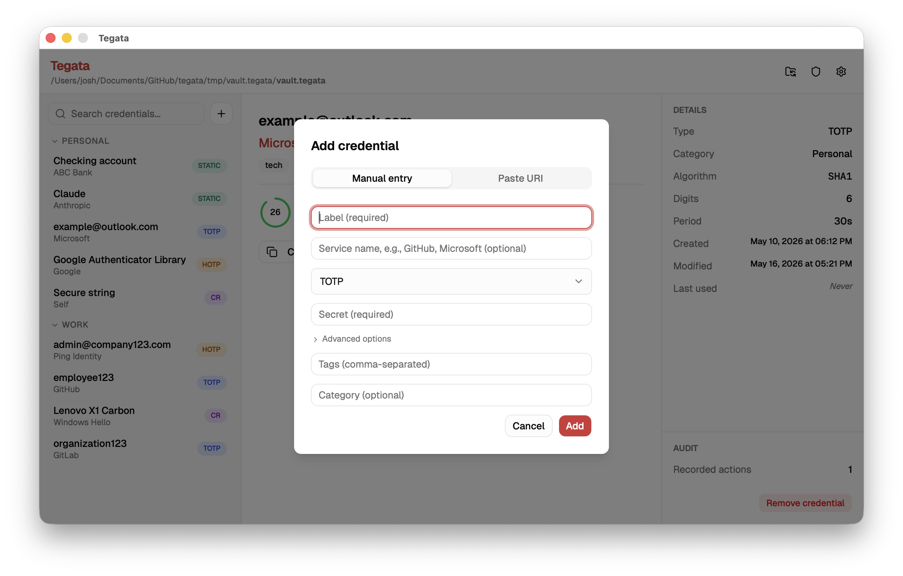
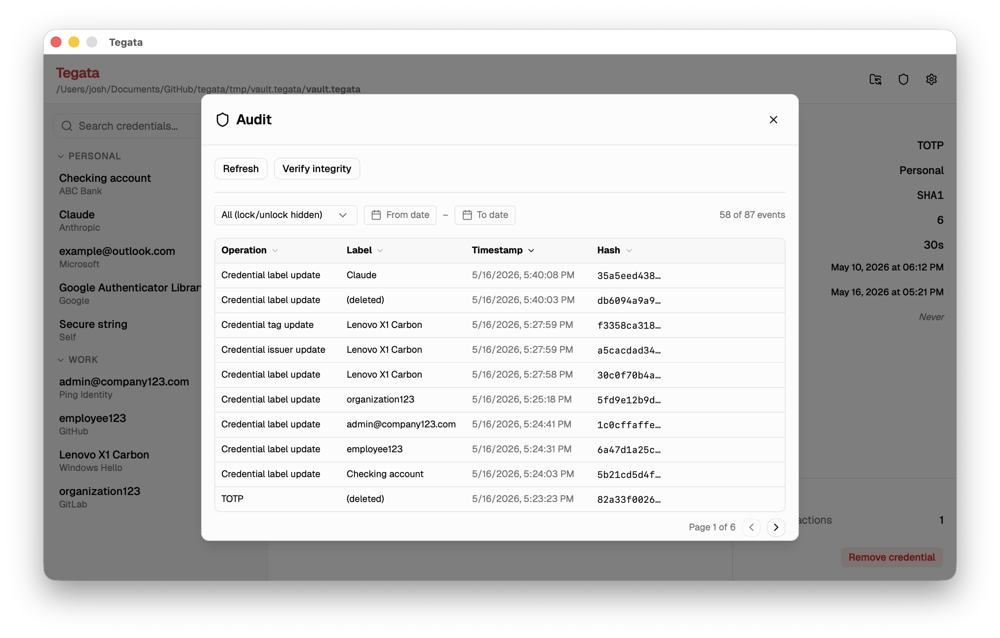

import Tabs from '@theme/Tabs';
import TabItem from '@theme/TabItem';

Tegataデスクトップ GUI は、グラフィカルインターフェースを使用してCLIおよびTUIと同じボールト管理とクレデンシャル操作を提供します。セットアップウィザード、タイプ固有のクレデンシャルアクション（例：TOTPカウントダウンタイマー）、設定パネル、および監査パネルが含まれています。

:::note[GUIはホストマシンに保存されます]

USBドライブと一緒にボールトを持ち運ぶように設計されたCLIバイナリとは異なり、GUIはホストマシンにインストールされます。ボールトファイル自体は常にUSBドライブまたはmicroSDカードに保存されます。

:::

## GUIのインストール {#install-the-gui}

<Tabs groupId="os" queryString>
  <TabItem value="windows" label="Windows">

[GitHubリリース](https://github.com/josh-wong/tegata/releases)ページから`tegata-gui-windows-amd64-setup.exe`をダウンロードします。インストーラーを実行してプロンプトに従います。GUIは`Program Files\Tegata\`にインストールされ、スタートメニューのエントリが自動的に作成されます。

:::note

初回起動時に、Microsoft Defender SmartScreenが「このアプリを実行するにはご使用のPCは保護されています」と表示する場合があります。**詳細情報**を選択してから**実行**を選択してください。

:::
  </TabItem>
  <TabItem value="macos" label="macOS">

[GitHubリリース](https://github.com/josh-wong/tegata/releases)ページから`tegata-gui-darwin-universal.dmg`をダウンロードします。ディスクイメージを開き、**Tegata**を**アプリケーション**フォルダーにドラッグします。

:::note

初回起動時に、macOS Gatekeeperがアプリをブロックすることがあります。メッセージが表示された場合は、**システム設定 → プライバシーとセキュリティ**を開いてTegataの**このまま開く**を選択します。Gatekeeperが引き続きブロックする場合は、検疫フラグをクリアします。

```bash
xattr -r -d com.apple.quarantine /Applications/Tegata.app
```

:::
  </TabItem>
  <TabItem value="linux" label="Linux">

:::note[Linuxサポート]

Linuxは手動でテストされていません。これらの手順は動作することが期待されますが、問題が発生した場合は[issueを作成](https://github.com/josh-wong/tegata/issues)してください。

:::

[GitHubリリース](https://github.com/josh-wong/tegata/releases)ページからディストリビューション用のパッケージをダウンロードします。

```bash
# Debian / Ubuntu
sudo dpkg -i tegata-gui-linux-amd64.deb

# Fedora / RHEL
sudo rpm -i tegata-gui-linux-amd64.rpm
```

GUIにはWebKit2GTKが必要です。アプリが起動しない場合は、ディストリビューションのリリースに合ったランタイムパッケージをインストールして再試行します。

```bash
# Ubuntu / Debian（新しいリリース）
sudo apt install libwebkit2gtk-4.1-0

# Ubuntu / Debian（古いリリース）
sudo apt install libwebkit2gtk-4.0-37
```

それでもアプリが起動しない場合は、[トラブルシューティング](troubleshooting.mdx#the-gui-doesnt-launch)を参照してください。

  </TabItem>
</Tabs>

## セットアップウィザードを起動してボールトを作成する

Tegataを初めて開くと、ボールトの検索または作成を求めるメッセージが表示されます。USBドライブがすでに接続されている場合は、**既存のボールトを開く**を選択してボールトファイルに移動します。まだボールトを作成していない場合は、**新しいボールトを作成**を選択します。

セットアップウィザードは以下の手順を案内します。

1. **ボールトの場所を選択します。** ボールトを作成するUSBドライブまたはmicroSDカードのディレクトリを選択します。
2. **パスフレーズを作成します。** パスフレーズを入力して確認します。強度インジケーターが推定セキュリティレベルを示します。
3. **リカバリーキーを保存します。** リカバリーキーは一度だけ表示されます。コピーしてUSBドライブとは物理的に別の安全な場所に保管します。
4. **最初のクレデンシャルを追加します。** セットアップ直後にクレデンシャルを追加するか、この手順をスキップします。

:::danger[続行を選択する前にリカバリーキーを保存してください]

リカバリーキー画面は再度表示されません。このキーなしにパスフレーズを失った場合、ボールトを回復できません。

:::

## ボールトのアンロック

ボールトをアンロックすると、左サイドバーにクレデンシャルのリストが表示されます。



## クレデンシャルの追加

ツールバーの**+**ボタンまたはファイルメニューの**クレデンシャルを追加**オプションを選択して、クレデンシャル追加ダイアログを開きます。



ダイアログには4つのクレデンシャルタイプに対応する4つのタブがあります：**TOTP**、**HOTP**、**チャレンジ・レスポンス**、**スタティックパスワード**。必要なフィールドに入力して**追加**を選択します。

`otpauth://` URIを直接貼り付けてクレデンシャルを追加することもできます。**URIをスキャン**を選択して入力フィールドにURIを貼り付けます。タイプ、ラベル、発行者、アルゴリズム、桁数、および期間が自動的に入力されます。

## クレデンシャルの使用

リスト内の任意のクレデンシャルを選択します。右側の詳細パネルがクレデンシャルタイプに基づいて更新されます。

- **TOTP:** **コピー**を選択して現在の出力をクリップボードにコピーします。カウントダウンタイマーが次のコードまでの時間を示します。
- **HOTP:** **コードを生成**を選択して現在の出力をクリップボードにコピーします。クリップボードはデフォルトで45秒後に自動的にクリアされます（設定で変更可能）。
- **チャレンジ・レスポンス:** チャレンジ文字列を入力して**署名**を選択します。署名が生成されます。**コピー**を選択してクリップボードにコピーします。
- **スタティックパスワード:** **クリップボードにコピー**を選択してパスワードをコピーします。パスワードはUIに表示されません。これは、スタティックパスワードを使用する際のショルダーサーフィングや偶発的な露出を防ぐためのセキュリティ対策です。

:::note[クリップボードの自動クリア]

クリップボードはデフォルトで45秒後に自動的にクリアされます（設定で変更可能）。これは、手動でクリアするのを忘れた場合に機密データがクリップボードに残るリスクを最小化するためのセキュリティ対策です。

:::

## クレデンシャルの編集または削除

リスト内のクレデンシャルを右クリックしてオプションにアクセスします。

- **タグを編集する。** クレデンシャルを整理するためのタグを追加または削除します。
- **コードをコピーする。** OTPおよびスタティックパスワードのクレデンシャルの場合、シングルクリックと同じです。
- **削除する。** 削除前に確認ダイアログが表示されます。

## アプリ設定の構成

設定パネルにアクセスするには、歯車アイコンを選択するか、アプリケーションメニューから**設定**を開きます。


利用可能な設定：

| 設定 | 説明 | デフォルト |
|---------|-------------|---------|
| クリップボードクリア遅延 | コピー後にクリップボードがクリアされるまでの秒数 | 45 |
| アイドルタイムアウト | ボールトが自動ロックされるまでの分数 | 5 |
| テーマ | ライト、ダーク、またはシステム | システム |
| 監査の自動起動 | アンロック時にDockerの監査スタックを自動的に起動する | オン（`tegata ledger start`の後） |

## 監査パネルでイベントを表示する {#view-events-in-the-audit-panel}

監査パネルは、`tegata ledger start`（CLI）またはGUIの設定パネルを通じて監査ログを有効にした後に利用できます。



パネルには操作タイプ、クレデンシャルラベル、タイムスタンプ（UTC）、イベントハッシュの列を持つ記録済みイベントのテーブルが表示されます。日付フィルターを使用して範囲を絞り込みます。**整合性を確認**を選択して`tegata verify`を実行し、監査チェーン全体を確認します。

削除されたクレデンシャルのイベントは、ラベル列に**(deleted)**として表示されます。これは、ラベルハッシュがレジャーに保存されているが、平文のラベルがボールトにもう存在しないため、予想される動作です。

## ボールトの管理

**ファイル**メニューからボールト管理オプションにアクセスします。

| オプション | 説明 |
|--------|-------------|
| **バックアップをエクスポート** | 独立したエクスポートパスフレーズを使用して暗号化された`.tegata-backup`ファイルを作成する |
| **バックアップをインポート** | `.tegata-backup`ファイルから現在のボールトにクレデンシャルをマージする |
| **パスフレーズを変更** | ボールトパスフレーズをローテーションする |
| **リカバリーキーを確認** | 保存されたリカバリーキーがまだ有効であることを確認する |
| **ボールトをロック** | 終了せずにボールトをすぐにロックする |

## 既知の制限事項

- **WebViewヒープ内のパスフレーズ。** パスフレーズは基盤となるWebViewプロセスのJavaScript文字列として一時的に保持されます。JavaScript文字列はイミュータブルで非決定論的にガベージコレクションされるため、Go側がコピーをゼロにした後も短時間パスフレーズがV8ヒープに残る場合があります。これはWebViewアーキテクチャの既知の制限です。詳細については、[セキュリティのベストプラクティス](security-best-practices.mdx#key-material-handling)を参照してください。
- **クロスコンパイルなし。** GUIバイナリは、システムWebView（WindowsではWebView2、macOSではWKWebView、LinuxではWebKit2GTK）に依存しているため、各プラットフォームのネイティブビルドが必要です。すべてのプラットフォーム向けのビルド済みバイナリはリリースページで入手できます。

グラフィカルアプリケーションのオーバーヘッドなしにキーボード駆動のターミナル操作を行う場合は、[TUIの使用](tui-guide.mdx)ガイドを参照してください。
